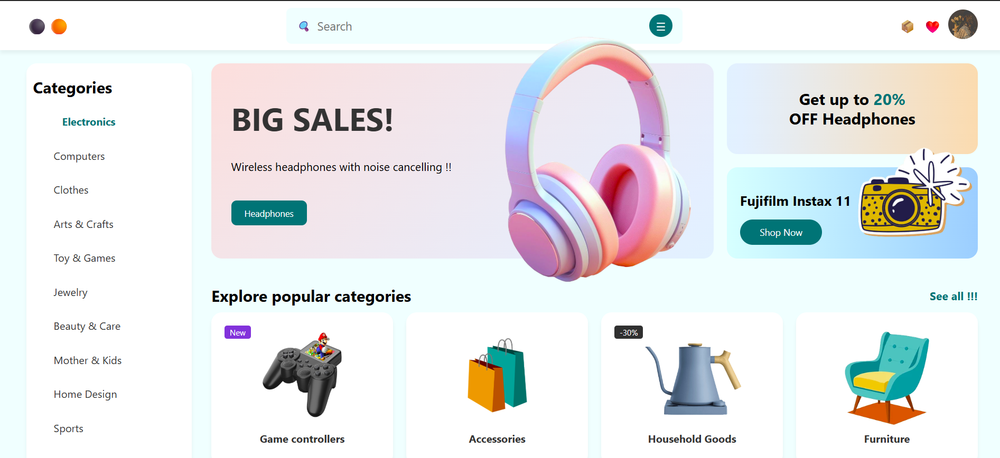

<h2>Modern E-commerce Interface</h2>

A vibrant, user-centric e-commerce dashboard featuring a clean pastel aesthetic, categorized navigation, and responsive promotional grids. Built with vanilla HTML5, CSS3 (Flexbox/Grid), and JavaScript.

<ul>
  <li>Easy navigation through diverse departments (Electronics, Computers, Home Design, etc.)</li>
  <li>Eye-catching "Big Sales" banner for featured products like noise-cancelling headphones.</li>
  <li>Integrated "New" and "Discount Percentage" badges for product cards.</li>
</ul>

